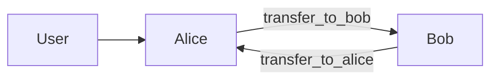
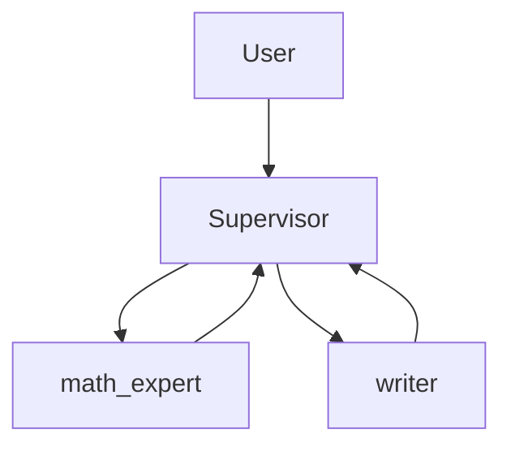

# LangGraph Agent Starter Kit

> Build multi-agent apps with LangGraph in TypeScript. Clone, configure, ship.

```
npm install && cp .env.example .env   # add your OPENAI_API_KEY
npm run dev                           # run the CLI demo
npm run dev:http                      # start the HTTP server
```

**What's inside:**

| Feature | What you get |
|---------|-------------|
| 4 example apps | Swarm, Supervisor, Human-in-the-Loop, Structured Output |
| MCP support | Plug in any MCP server via JSON config — tools auto-injected into agents |
| Streaming | SSE endpoint for token-by-token output |
| Persistence | MemorySaver for dev, PostgreSQL-ready for prod |
| Thread mgmt | Inspect state, browse history, resume after interrupts |
| Docker | `docker compose up` and you're running with Postgres |

---

## Quick Start

**Prerequisites:** Node 18+, an OpenAI API key.

```shell
git clone <repo-url> && cd langgraph-starter-kit
npm install
cp .env.example .env          # paste your OPENAI_API_KEY
npm run dev                   # runs all 4 demo apps in the terminal
```

To start the HTTP server instead:

```shell
npm run dev:http              # http://localhost:3000
```

That's it. You now have four agent apps running with streaming, thread memory, and interrupt support.

---

## Project Layout

```
src/
  config/
    env.ts              # loads .env, validates required vars
    llm.ts              # shared LLM instance (model configurable via env)
    checkpointer.ts     # swap between MemorySaver (dev) and PostgresSaver (prod)
  tools/
    local.ts            # example tools: add, multiply, echo
    mcp.ts              # loads + caches MCP tools, logs what was loaded
  agents/
    factory.ts          # makeAgent()  — typed wrapper around createReactAgent
    handoff.ts          # createHandoffTool()  — swarm agent transfers
    supervisor.ts       # makeSupervisor()  — builds a supervisor graph
    swarm.ts            # makeSwarm()  — builds a swarm graph
  apps/
    swarm.ts            # createSwarmApp(mcpTools)  — Alice <-> Bob
    supervisor.ts       # createSupervisorApp(mcpTools) — Math + Writer
    interrupt.ts        # createInterruptApp() — delete with human approval
    analyst.ts          # createAnalystApp() — structured { title, keyPoints, sentiment }
  server/
    index.ts            # Fastify — loads MCP, builds apps, registers routes
  index.ts              # CLI entry point — loads MCP, runs all 4 demos

Dockerfile
docker-compose.yml      # app + Postgres
mcp-servers.example.json
```

**Where to look first:**
- Want to see how agents are wired? Start with `src/apps/supervisor.ts`.
- Want to add your own tool? Open `src/tools/local.ts`.
- Want to understand the HTTP API? Read `src/server/index.ts`.

---

## Environment Variables

Copy `.env.example` to `.env` and fill in:

| Variable | Required | Default | Description |
|----------|----------|---------|-------------|
| `OPENAI_API_KEY` | yes | — | Your OpenAI key |
| `PORT` | no | `3000` | HTTP server port |
| `LLM_MODEL` | no | `gpt-4o-mini` | Any OpenAI model name |
| `LLM_TEMPERATURE` | no | `0` | Model temperature |
| `MCP_SERVERS_PATH` | no | — | Path to MCP config JSON |
| `DATABASE_URL` | no | — | Postgres connection string (enables persistent checkpointing) |

---

## The Four Demo Apps

### 1. Swarm — peer-to-peer agents

Two agents that hand off to each other. Alice does addition, Bob does multiplication (and talks like a pirate). Both receive MCP tools if configured.



**Key concept:** agents decide *when* to hand off using tool calls. No central router.

### 2. Supervisor — central orchestrator

A supervisor agent decides which specialist handles each part of the request. The math agent receives MCP tools alongside its local tools.



**Key concept:** the supervisor sees the full conversation and picks the best agent per turn.

### 3. Interrupt — human-in-the-loop

A database admin agent that *pauses for human approval* before deleting records.

```
User: "delete record rec_2"
  -> Agent calls delete_record tool
  -> Tool calls interrupt() — graph pauses
  -> You send a resume decision ("yes" / "no")
  -> Graph continues with your answer
```

**Key concept:** `interrupt()` saves state to the checkpointer and halts. Resume with `Command({ resume: "yes" })`.

### 4. Analyst — structured output

Returns a validated Zod object instead of freeform text:

```ts
{ title: string, keyPoints: string[], sentiment: "positive" | "negative" | "neutral" }
```

**Key concept:** pass a Zod schema as `responseFormat` to `makeAgent()` and the output is type-safe.

---

## HTTP API

Start the server with `npm run dev:http`. All endpoints use the pattern `/:app/...` where app is `swarm`, `supervisor`, `interrupt`, or `analyst`.

### POST `/:app/invoke` — full response

```shell
curl -s http://localhost:3000/supervisor/invoke \
  -H "Content-Type: application/json" \
  -d '{
    "messages": [{"role":"user","content":"add 5 and 3, then summarize"}],
    "thread_id": "t1"
  }' | jq
```

### POST `/:app/stream` — SSE token stream

```shell
curl -N http://localhost:3000/supervisor/stream \
  -H "Content-Type: application/json" \
  -d '{
    "messages": [{"role":"user","content":"add 5 and 3"}],
    "thread_id": "t1"
  }'
```

Output:

```
data: {"type":"token","content":"The","node":"math_expert"}
data: {"type":"token","content":" sum","node":"math_expert"}
data: {"type":"done"}
```

### POST `/:app/resume` — continue after interrupt

```shell
curl -s http://localhost:3000/interrupt/resume \
  -H "Content-Type: application/json" \
  -d '{"thread_id":"t1","decision":"yes"}' | jq
```

### GET `/:app/threads/:id` — current thread state

```shell
curl -s http://localhost:3000/supervisor/threads/t1 | jq
```

### GET `/:app/threads/:id/history` — full state history

```shell
curl -s http://localhost:3000/supervisor/threads/t1/history | jq
```

### GET `/health`

```json
{"status":"ok","apps":["swarm","supervisor","interrupt","analyst"],"mcpToolsLoaded":0}
```

---

## MCP Tools

Plug in external tools from any [MCP server](https://modelcontextprotocol.io) via JSON config. Tools are loaded once at startup, cached, and injected into the swarm and supervisor agents automatically.

**Setup:**

```shell
cp mcp-servers.example.json mcp-servers.json
```

Edit `mcp-servers.json`:

```json
{
  "throwOnLoadError": true,
  "prefixToolNameWithServerName": true,
  "onConnectionError": "ignore",
  "mcpServers": {
    "my-tools": {
      "transport": "stdio",
      "command": "npx",
      "args": ["-y", "@modelcontextprotocol/server-math"],
      "restart": { "enabled": true, "maxAttempts": 3, "delayMs": 1000 }
    },
    "remote-api": {
      "transport": "http",
      "url": "https://my-mcp-server.com/mcp",
      "headers": { "Authorization": "Bearer token123" }
    }
  }
}
```

Add to `.env`:

```shell
MCP_SERVERS_PATH=./mcp-servers.json
```

**How it works:**

1. `loadMcpTools()` reads the config, connects to all servers, and calls `getTools()`
2. Tools are passed into `createSwarmApp(mcpTools)` and `createSupervisorApp(mcpTools)`
3. Agents receive both local tools (add, multiply) and MCP tools
4. Startup logs each loaded tool name and description
5. The MCP client is closed on server shutdown

**Config options:**

| Option | Default | Description |
|--------|---------|-------------|
| `throwOnLoadError` | `true` | Throw if a tool fails to load from a connected server |
| `prefixToolNameWithServerName` | `true` | Avoids name collisions across servers (e.g. `my-tools__add`) |
| `onConnectionError` | `"throw"` | `"ignore"` skips unavailable servers instead of crashing |
| `restart` (stdio only) | — | Auto-restart crashed stdio subprocesses |

Supports `stdio`, `http`, and `sse` transports.

---

## How to Extend

### Add a tool

Edit `src/tools/local.ts`:

```ts
export const fetchUser = tool(
  async ({ userId }) => JSON.stringify({ id: userId, name: "Jane" }),
  {
    name: "fetch_user",
    description: "Look up a user by ID",
    schema: z.object({ userId: z.string() }),
  }
);
```

Then add it to an agent's `tools` array in any `src/apps/*.ts` file.

### Add an agent

```ts
import { llm } from "../config/llm";
import { makeAgent } from "../agents/factory";
import { fetchUser } from "../tools/local";

const userAgent = makeAgent({
  name: "user_expert",
  llm,
  tools: [fetchUser],
  system: "You help look up user information.",
});
```

### Add a new app

1. Create `src/apps/myapp.ts` with a factory function:

```ts
import type { DynamicStructuredTool } from "@langchain/core/tools";
import { llm } from "../config/llm";
import { makeAgent } from "../agents/factory";
import { makeSupervisor } from "../agents/supervisor";

export function createMyApp(mcpTools: DynamicStructuredTool[] = []) {
  const agent = makeAgent({
    name: "my_agent",
    llm,
    tools: [...mcpTools],
    system: "You are a helpful assistant.",
  });

  return makeSupervisor({
    agents: [agent],
    llm,
    supervisorName: "my_supervisor",
  });
}
```

2. Register it in `src/server/index.ts` inside `startServer()`:

```ts
const apps = {
  // ...existing apps...
  myapp: createMyApp(mcpTools) as typeof swarmApp,
};
```

Now `POST /myapp/invoke`, `POST /myapp/stream`, etc. all work automatically.

### Add structured output to any agent

Pass a Zod schema as `responseFormat`:

```ts
const agent = makeAgent({
  name: "extractor",
  llm,
  tools: [...],
  responseFormat: z.object({
    name: z.string(),
    email: z.string(),
  }),
});
```

### Add human approval to any tool

Use `interrupt()` inside your tool:

```ts
import { interrupt } from "@langchain/langgraph";

const riskyAction = tool(
  async (args) => {
    const decision = interrupt({
      message: `Run this action? ${JSON.stringify(args)}`,
    });
    if (decision !== "yes") return "Cancelled.";
    return doTheThing(args);
  },
  { name: "risky_action", description: "...", schema: z.object({ ... }) }
);
```

### Use private message state

Keeps an agent's internal chat hidden from the parent graph:

```ts
const agent = makeAgent({
  name: "alice",
  llm,
  tools: [...],
  privateMessagesKey: "alice_internal",
});
```

### Supervisor options

| Option | What it does |
|--------|-------------|
| `outputMode` | `"last_message"` (default) or `"full_history"` |
| `preModelHook` | Run before the LLM call — trim context, inject data |
| `postModelHook` | Run after — guardrails, validation |
| `responseFormat` | Zod schema for structured supervisor output |

---

## Memory & Persistence

### Thread memory (short-term)

Every request with the same `thread_id` continues the same conversation. This works out of the box — just pass `thread_id` in your requests.

### Cross-thread memory (long-term)

The `InMemoryStore` lets agents share data across threads. For production, swap it for a persistent store.

### Production: switch to PostgreSQL

```shell
npm install @langchain/langgraph-checkpoint-postgres
```

Uncomment the PostgresSaver block in `src/config/checkpointer.ts`, set `DATABASE_URL` in `.env`, done.

Or just use Docker Compose — it sets up Postgres for you:

```shell
docker compose up --build
```

---

## Docker

### Full stack (app + Postgres)

```shell
docker compose up --build
# App: http://localhost:3000
# Postgres: localhost:5432
```

### App only

```shell
docker build -t langgraph-starter .
docker run -p 3000:3000 --env-file .env langgraph-starter
```

---

## Troubleshooting

| Problem | Fix |
|---------|-----|
| `OPENAI_API_KEY is required` | Set it in `.env` |
| `Unknown app: foo` | App name must be `swarm`, `supervisor`, `interrupt`, or `analyst` |
| `Failed to parse MCP config` | Check your `mcp-servers.json` is valid JSON |
| MCP server not connecting | Set `"onConnectionError": "ignore"` to skip unavailable servers |
| Handoffs not routing | Check agent names are unique and match `createHandoffTool({ agentName })` |
| Interrupt not pausing | A checkpointer is required — make sure you're using `getCheckpointer()` |
| Resume not working | Use the same `thread_id` for invoke and resume |

---

## Security

- **API keys** go in `.env` (gitignored).
- **Tool inputs** are validated with Zod schemas.
- **MCP config** (`mcp-servers.json`) is gitignored since it may contain tokens.
- **HTTP endpoints** have no auth by default — add rate limiting and authentication before exposing publicly.
