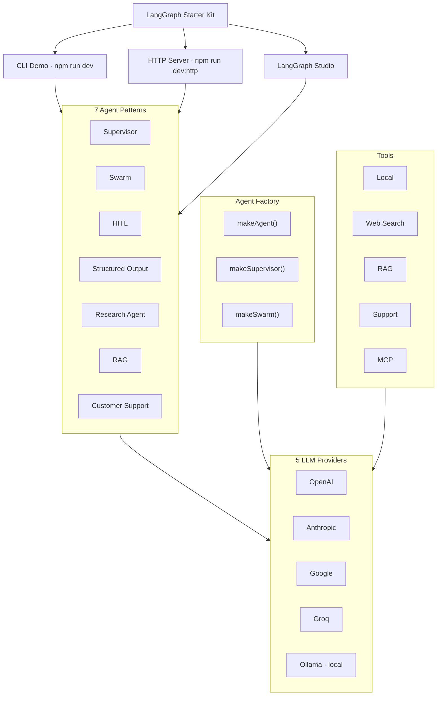

<p align="center">
  <h1 align="center">LangGraph Starter Kit</h1>
  <p align="center">
    The fastest way to build production-ready multi-agent apps with LangGraph.
    <br />
    <strong>7 patterns. 5 providers. One command.</strong>
  </p>
</p>

<p align="center">
  <a href="https://github.com/ac12644/langgraph-starter-kit/actions/workflows/ci.yml"></a>
  <a href="https://opensource.org/licenses/Apache-2.0"></a>
  <a href="https://www.typescriptlang.org/"></a>
  <a href="https://langchain-ai.github.io/langgraphjs/"></a>
  <a href="https://github.com/ac12644/langgraph-starter-kit/stargazers"></a>
</p>

<p align="center">
  <a href="#quick-start">Quick Start</a> &bull;
  <a href="#agent-patterns">Patterns</a> &bull;
  <a href="#llm-providers">Providers</a> &bull;
  <a href="#examples">Examples</a> &bull;
  <a href="#api-reference">API</a> &bull;
  <a href="CONTRIBUTING.md">Contributing</a>
</p>

---

## Why This Exists

Building multi-agent systems with LangGraph means writing the same boilerplate over and over — setting up supervisors, wiring handoff tools, configuring providers, adding persistence. This starter kit gives you all of that out of the box so you can focus on your agent logic, not infrastructure.

```bash
npx create-langgraph-app
```

**What you get:**
- Pick your LLM provider (OpenAI, Anthropic, Google, Groq, or local Ollama)
- Choose which agent patterns you need
- Get a ready-to-run project with tests, types, and a Fastify server

Or clone the full kit with all 7 patterns included.

## Architecture



## Features

| | Feature | Description |
|---|---|---|
| **Patterns** | 7 Agent Patterns | Swarm, Supervisor, HITL, Structured Output, Research, RAG, Customer Support |
| **Modern** | v1 Agent APIs | Built on LangChain's `createAgent` with the subagents & handoffs patterns — no deprecated packages |
| **CLI** | Scaffolder | `npx create-langgraph-app` — interactive project generator |
| **Providers** | 5 LLM Providers | OpenAI, Anthropic, Google, Groq, Ollama — switch with one env var |
| **Tools** | MCP Integration | Connect external tools via Model Context Protocol |
| **Server** | HTTP + SSE | Fastify server with invoke, streaming, resume, and thread history |
| **Debug** | LangGraph Studio | `langgraph.json` included for visual graph debugging |
| **Observe** | LangSmith Tracing | Full observability with one env var |
| **Persist** | Memory + Postgres | In-memory for dev, PostgreSQL-ready for production |
| **Deploy** | Docker + CI | Docker Compose with Postgres, GitHub Actions CI |
| **Test** | 39 Tests | Tools, config, agents, offline multi-agent flows — all tested with vitest |

## Quick Start

### Option A: Scaffold a new project (recommended)

```bash
npx create-langgraph-app
```

Interactive CLI — pick your provider, choose your patterns, get a project:

```
  ╔═══════════════════════════════════════╗
  ║     create-langgraph-app              ║
  ╚═══════════════════════════════════════╝

  Project name (my-langgraph-app): my-agents
  
  LLM provider?
    1. OpenAI (gpt-4o-mini)
    2. Anthropic (Claude Sonnet)
    3. Google (Gemini 2.0 Flash)
    4. Groq (Llama 3.3 70B)
    5. Ollama (local, no API key)

  Which patterns?
    1. Supervisor
    2. Swarm
    3. Human-in-the-Loop
    4. Structured Output
    5. RAG

  Done! cd my-agents && npm run dev
```

### Option B: Clone the full starter kit

```bash
git clone https://github.com/ac12644/langgraph-starter-kit.git
cd langgraph-starter-kit
npm install
cp .env.example .env    # Add your API key
npm run dev             # Run all 7 patterns
npm run dev:http        # Start HTTP server on :3000
```

## LLM Providers

Switch providers with one env var. Each has a sensible default model:

| Provider | `LLM_PROVIDER` | Default Model | API Key |
|---|---|---|---|
| **OpenAI** | `openai` | gpt-4o-mini | `OPENAI_API_KEY` |
| **Anthropic** | `anthropic` | claude-sonnet-4-20250514 | `ANTHROPIC_API_KEY` |
| **Google** | `google` | gemini-2.0-flash | `GOOGLE_API_KEY` |
| **Groq** | `groq` | llama-3.3-70b-versatile | `GROQ_API_KEY` |
| **Ollama** | `ollama` | llama3.2 | None (runs locally) |

```bash
# .env — just two lines to switch
LLM_PROVIDER=anthropic
ANTHROPIC_API_KEY=sk-ant-...
```

## Agent Patterns

> **Architecture note:** The `@langchain/langgraph-supervisor` and `@langchain/langgraph-swarm` packages are no longer actively maintained upstream. This kit implements the officially recommended replacements: the **subagents** pattern (a `createAgent` supervisor calling workers as tools) and the **handoffs** pattern (agents as graph nodes with `Command`-based transfer tools). Same API surface, no deprecated dependencies.

### 1. Supervisor

A central coordinator routes tasks to specialized workers. Best for: **structured workflows with clear task delegation**.

```bash
curl -X POST http://localhost:3000/supervisor/invoke \
  -H "Content-Type: application/json" \
  -d '{"messages": [{"role": "user", "content": "sum 10 and 15, then write a summary"}]}'
```

### 2. Swarm

Agents hand off to each other peer-to-peer using transfer tools. Best for: **open-ended conversations where the right agent depends on context**.

```bash
curl -X POST http://localhost:3000/swarm/invoke \
  -H "Content-Type: application/json" \
  -d '{"messages": [{"role": "user", "content": "talk to bob then add 5 and 7"}]}'
```

### 3. Human-in-the-Loop

Pauses the graph for human approval before dangerous actions. Best for: **high-stakes operations — deletions, payments, emails**.

```bash
# Trigger an action that needs approval
curl -X POST http://localhost:3000/interrupt/invoke \
  -H "Content-Type: application/json" \
  -d '{"messages": [{"role": "user", "content": "delete record rec_2"}], "thread_id": "hitl-1"}'

# Approve it
curl -X POST http://localhost:3000/interrupt/resume \
  -H "Content-Type: application/json" \
  -d '{"thread_id": "hitl-1", "decision": "yes"}'
```

### 4. Structured Output

Returns typed JSON validated by Zod (in the `structuredResponse` field of the response). Best for: **extracting structured data — summaries, classifications, entities**.

```bash
curl -X POST http://localhost:3000/analyst/invoke \
  -H "Content-Type: application/json" \
  -d '{"messages": [{"role": "user", "content": "Analyze: Revenue grew 25% but churn increased 8%"}]}'
```

### 5. Research Agent

Web search + URL scraping coordinated by a supervisor. Best for: **gathering and synthesizing information from the web**.

```bash
curl -X POST http://localhost:3000/researcher/invoke \
  -H "Content-Type: application/json" \
  -d '{"messages": [{"role": "user", "content": "Research multi-agent AI systems"}]}'
```

### 6. RAG (Retrieval-Augmented Generation)

In-memory vector store with semantic search. Best for: **answering questions about your own documents/knowledge base**.

```bash
curl -X POST http://localhost:3000/rag/invoke \
  -H "Content-Type: application/json" \
  -d '{"messages": [{"role": "user", "content": "What is the supervisor pattern?"}]}'
```

### 7. Customer Support Bot

Multi-agent support system with a router that delegates to billing, tech support, and returns specialists. Includes escalation to human operators. Best for: **customer-facing products with different support domains**.

```bash
curl -X POST http://localhost:3000/support/invoke \
  -H "Content-Type: application/json" \
  -d '{"messages": [{"role": "user", "content": "I am customer C-1002. I was charged $29.99 but my plan is free. Can you help?"}]}'
```

## Streaming

Every app supports SSE for real-time token streaming:

```bash
curl -N http://localhost:3000/supervisor/stream \
  -H "Content-Type: application/json" \
  -d '{"messages": [{"role": "user", "content": "what is 2+2?"}]}'
```

## MCP Integration

Extend your agents with external tools via [Model Context Protocol](https://modelcontextprotocol.io/):

```bash
cp mcp-servers.example.json mcp-servers.json
# Edit mcp-servers.json with your MCP server configs
# Set MCP_SERVERS_PATH=./mcp-servers.json in .env
```

Supports both `stdio` (local) and `http` (remote) transports. Tools are auto-injected into swarm and supervisor apps.

## Observability

### LangGraph Studio

```bash
langgraph dev    # Visual graph debugging
```

### LangSmith Tracing

```env
LANGCHAIN_TRACING_V2=true
LANGSMITH_API_KEY=ls_...
LANGSMITH_PROJECT=langgraph-starter-kit
```

## API Reference

| Route | Method | Description |
|---|---|---|
| `/:app/invoke` | POST | Invoke agent, return final result |
| `/:app/stream` | POST | SSE token streaming |
| `/:app/resume` | POST | Resume paused graph (HITL) |
| `/:app/threads/:id` | GET | Get thread state |
| `/:app/threads/:id/history` | GET | Full state history |
| `/health` | GET | Health check |

**Apps:** `swarm` `supervisor` `interrupt` `analyst` `researcher` `rag` `support`

## Examples

Real-world agent apps with full documentation:

| Example | Description | Patterns |
|---|---|---|
| **[Customer Support Bot](examples/customer-support/)** | Billing, tech support, returns routing with human escalation | Supervisor, HITL |
| **[Research Agent](examples/research-agent/)** | Web search + report writing pipeline | Supervisor |
| **[RAG Agent](examples/rag-agent/)** | Document indexing + semantic retrieval | Supervisor, RAG |

Each example has its own README with architecture diagrams, tool reference, usage examples, and customization guide.

## Project Structure

```
src/
├── config/
│   ├── env.ts              # Environment + provider validation
│   ├── llm.ts              # Multi-provider LLM factory
│   ├── embeddings.ts       # Multi-provider embeddings factory
│   └── checkpointer.ts     # Memory (dev) / Postgres (prod)
├── tools/
│   ├── local.ts            # Built-in tools (add, multiply, echo)
│   ├── web.ts              # Web search + URL scraping
│   ├── rag.ts              # Vector store + retrieval
│   ├── support.ts          # Customer support tools
│   └── mcp.ts              # MCP external tool loader
├── agents/
│   ├── factory.ts          # makeAgent() — createAgent wrapper
│   ├── supervisor.ts       # makeSupervisor() — subagents-as-tools pattern
│   ├── swarm.ts            # makeSwarm() — handoffs pattern (StateGraph)
│   └── handoff.ts          # createHandoffTool() — Command-based transfers
├── apps/
│   ├── supervisor.ts       # Supervisor pattern
│   ├── swarm.ts            # Swarm pattern
│   ├── interrupt.ts        # Human-in-the-loop
│   ├── analyst.ts          # Structured output
│   ├── researcher.ts       # Research agent
│   ├── rag.ts              # RAG agent
│   └── support.ts          # Customer support bot
├── server/index.ts         # Fastify HTTP server
└── index.ts                # CLI demo
examples/
├── customer-support/       # Full customer support bot docs
├── research-agent/         # Research agent docs
└── rag-agent/              # RAG agent docs
```

## Deploy

```bash
# Docker Compose (includes Postgres)
docker compose up

# Standalone Docker
docker build -t langgraph-starter .
docker run -p 3000:3000 --env-file .env langgraph-starter
```

| Platform | How |
|---|---|
| **Railway** | [Deploy](https://railway.com/new) with this repo URL |
| **Render** | Connect repo — uses `render.yaml` |
| **Docker** | `docker compose up` anywhere |

## Adding Your Own Agent

Create a file, wire it up, done:

```typescript
// src/apps/my-agent.ts
import { getLlm } from "../config/llm";
import { makeAgent } from "../agents/factory";
import { makeSupervisor } from "../agents/supervisor";

export async function createMyApp() {
  const llm = await getLlm();

  const agent = makeAgent({
    name: "my_agent",
    llm,
    tools: [/* your tools */],
    system: "You are a helpful assistant.",
  });

  return makeSupervisor({
    subagents: [
      {
        name: "my_agent",
        description: "When the supervisor should delegate to this agent.",
        agent,
      },
    ],
    llm,
    supervisorName: "my_supervisor",
  });
}
```

Register in `src/server/index.ts` and you're live.

## Contributing

Contributions are welcome! Whether it's a new agent pattern, bug fix, documentation improvement, or just a typo — every bit helps.

See **[CONTRIBUTING.md](CONTRIBUTING.md)** for guidelines.

**First time contributing?** Look for issues labeled [`good first issue`](https://github.com/ac12644/langgraph-starter-kit/labels/good%20first%20issue).

## Community

- **Questions?** Open a [Discussion](https://github.com/ac12644/langgraph-starter-kit/discussions)
- **Bug?** File an [Issue](https://github.com/ac12644/langgraph-starter-kit/issues)
- **Want to contribute?** See [CONTRIBUTING.md](CONTRIBUTING.md)
- **Like it?** Give it a star — it helps others find the project

## License

[Apache License 2.0](LICENSE) — same license as LangChain. Use it freely in personal and commercial projects.
