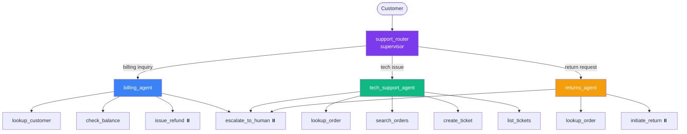

# Customer Support Bot

Multi-agent customer support system with intelligent routing, specialist agents, and human escalation.

## Architecture



> Tools marked with ⏸️ require human approval (HITL).

**support_router** classifies the customer's intent and delegates to:

- **billing_agent** — account lookups, balance inquiries, refunds (with HITL approval)
- **tech_support_agent** — order tracking, ticket creation, technical issues
- **returns_agent** — product returns for delivered orders (with HITL approval)

All agents can **escalate to a human operator** when the issue is too complex or the customer requests it.

## Tools

| Tool | Agent | Description |
|---|---|---|
| `lookup_customer` | Billing | Look up customer account by ID |
| `check_balance` | Billing | Check outstanding balance |
| `issue_refund` | Billing | Refund an order (requires approval) |
| `lookup_order` | Tech, Returns | Look up order by ID |
| `search_orders` | Tech, Returns | Find all orders for a customer |
| `create_ticket` | Tech | Create a support ticket |
| `list_tickets` | Tech | List tickets for a customer |
| `initiate_return` | Returns | Start a return (requires approval) |
| `escalate_to_human` | All | Escalate to human operator |

## Usage

```bash
# Billing inquiry
curl -X POST http://localhost:3000/support/invoke \
  -H "Content-Type: application/json" \
  -d '{"messages": [{"role": "user", "content": "I am customer C-1002. Why was I charged $29.99?"}]}'

# Tech support
curl -X POST http://localhost:3000/support/invoke \
  -H "Content-Type: application/json" \
  -d '{"messages": [{"role": "user", "content": "I am C-1001. Where is my order ORD-503?"}]}'

# Return request
curl -X POST http://localhost:3000/support/invoke \
  -H "Content-Type: application/json" \
  -d '{"messages": [{"role": "user", "content": "I am C-1001. I want to return order ORD-501, the headphones are too tight."}]}'
```

## Files

- `src/apps/support.ts` — Agent composition and routing
- `src/tools/support.ts` — All support tools with mock data
- `tests/tools/support.test.ts` — Tool unit tests

## Customizing

To use real data instead of mocks, replace the `CUSTOMERS`, `ORDERS`, and `TICKETS` objects in `src/tools/support.ts` with database queries or API calls.
