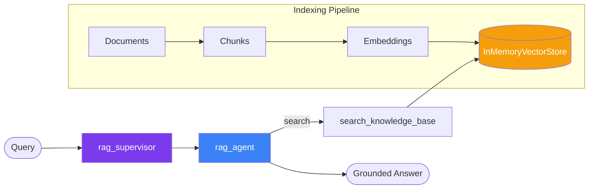

# RAG Agent

Retrieval-Augmented Generation agent with an in-memory vector store. Index documents, search semantically, and answer questions grounded in your knowledge base.

## Architecture



## How it works

1. **Indexing** — Documents are split into chunks, embedded, and stored in-memory
2. **Query** — User question is embedded and compared against stored chunks via cosine similarity
3. **Generation** — Top matching chunks are passed as context to the LLM for grounded answers

## Tools

| Tool | Description |
|---|---|
| `search_knowledge_base` | Semantic search over indexed documents, returns top-k matches |

## Usage

```bash
# The RAG store is auto-initialized with sample documents about LangGraph
curl -X POST http://localhost:3000/rag/invoke \
  -H "Content-Type: application/json" \
  -d '{"messages": [{"role": "user", "content": "What is the supervisor pattern?"}]}'
```

## Files

- `src/apps/rag.ts` — Agent composition + vector store initialization
- `src/tools/rag.ts` — InMemoryVectorStore, text splitting, retrieval tool, sample docs
- `src/config/embeddings.ts` — Multi-provider embeddings factory
- `tests/tools/rag.test.ts` — Unit tests with mock embeddings

## Sample Documents

The starter kit ships with 6 sample documents covering LangGraph concepts:
- LangGraph overview
- Supervisor pattern
- RAG technique
- Swarm pattern
- Human-in-the-loop
- Model Context Protocol

Replace `SAMPLE_DOCS` in `src/tools/rag.ts` with your own content, or call `initRagStore(yourDocs)` with custom documents.

## Customizing

- **Custom documents** — Pass your own docs to `initRagStore(["doc1", "doc2"])`
- **External vector store** — Replace `InMemoryVectorStore` with Pinecone, Weaviate, or pgvector
- **Chunk settings** — Adjust `chunkSize` and `chunkOverlap` in `buildVectorStore()`
- **Embeddings** — Automatically uses the right provider (OpenAI, Google, or Ollama)
