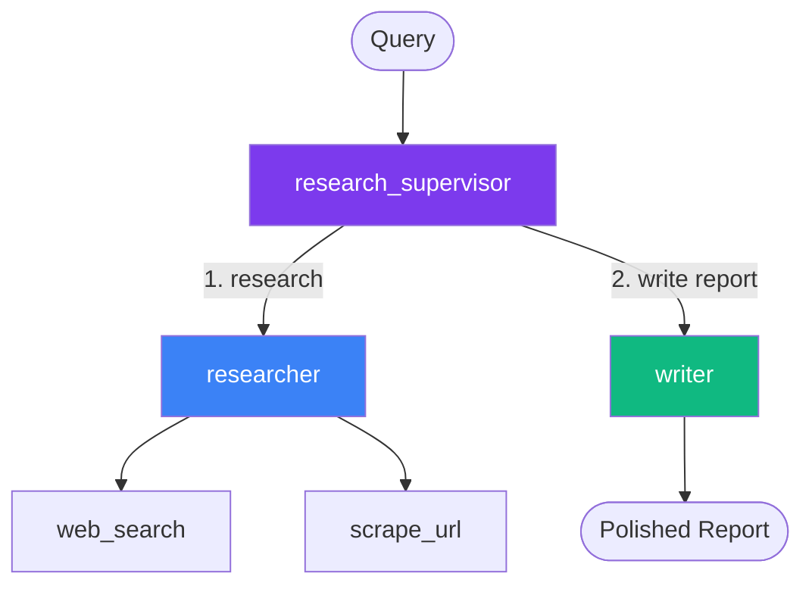

# Research Agent

A supervisor coordinates a researcher and a writer to produce polished reports from web research.

## Architecture



**research_supervisor** routes tasks:
1. Sends the query to **researcher** for web search and data gathering
2. Sends the findings to **writer** for a polished, structured report

## Tools

| Tool | Description |
|---|---|
| `web_search` | DuckDuckGo instant answer API (no API key needed) |
| `scrape_url` | Fetch and extract text from any URL |

## Usage

```bash
curl -X POST http://localhost:3000/researcher/invoke \
  -H "Content-Type: application/json" \
  -d '{"messages": [{"role": "user", "content": "Research the latest trends in multi-agent AI systems"}]}'
```

## Files

- `src/apps/researcher.ts` — Agent composition
- `src/tools/web.ts` — Web search and scraping tools
- `tests/tools/web.test.ts` — Tool unit tests

## Customizing

- Replace `web_search` with a paid API (Tavily, Serper, SerpAPI) for better results
- Add more specialized researchers (e.g., one for academic papers, one for news)
- Add a `fact_checker` agent between researcher and writer
